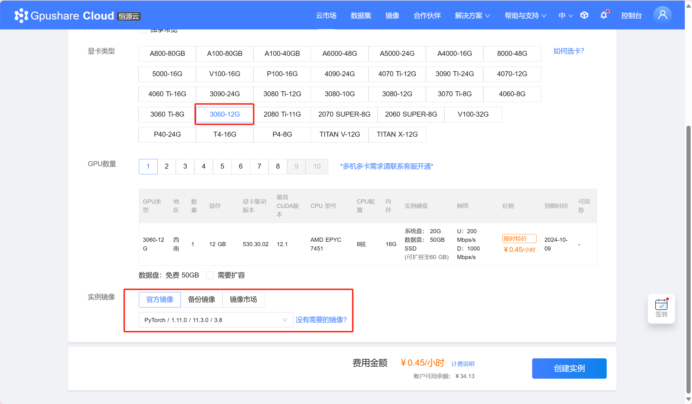
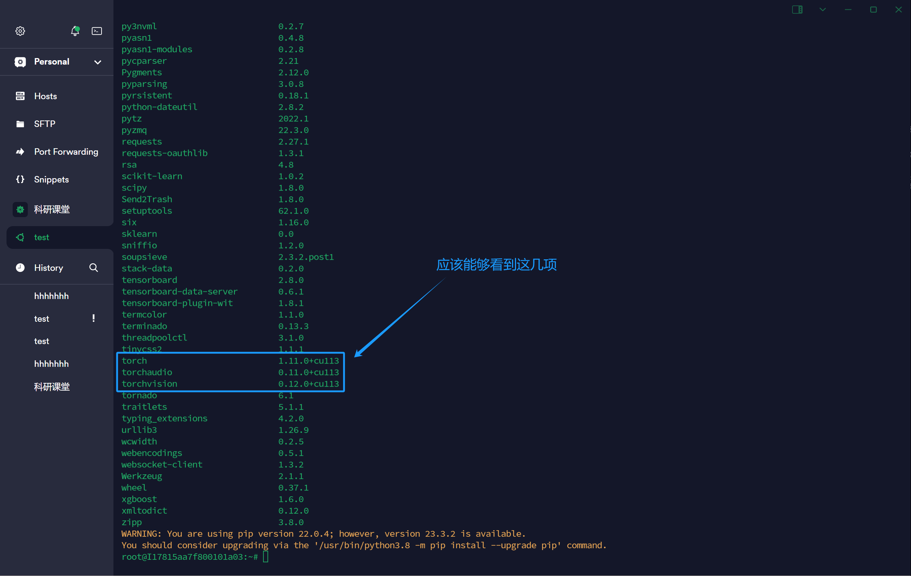
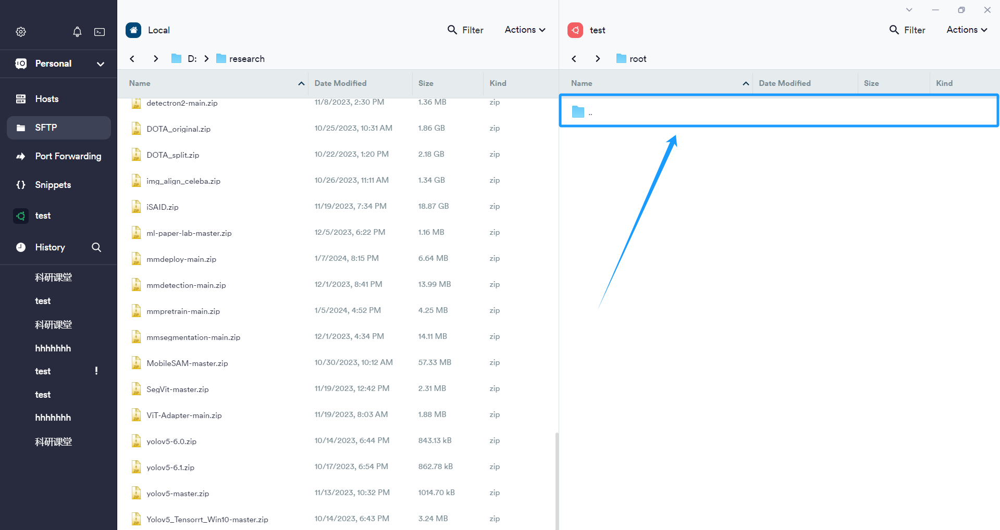
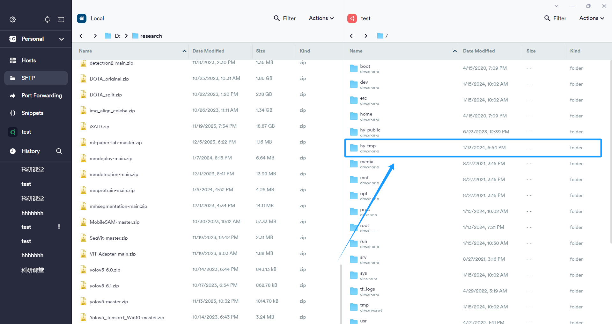
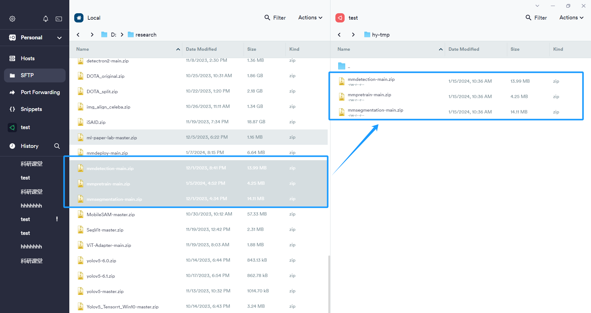
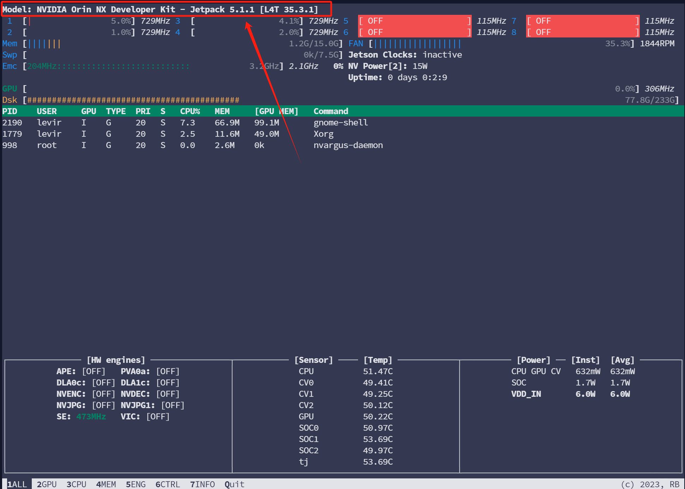
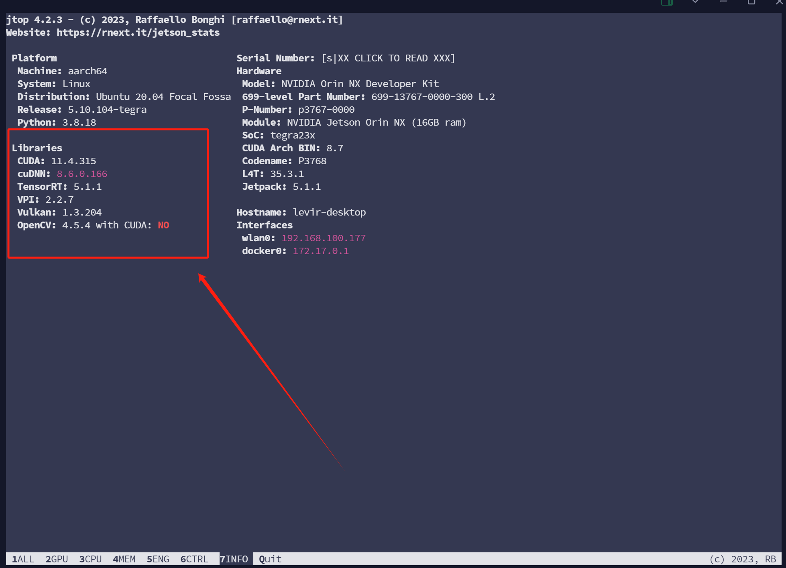

## IPCC终端环境配置

***

#### 一、云服务器开发环境配置:

**1. 在恒源云显卡租用平台创建实例，选择需要用的显卡，选择官方镜像：**

pytorch1.11.0 + cuda11.3.0 + python3.8




**2. 使用termius连接服务器，无需创建虚拟环境，可以使用base环境，直接查看环境，确保可以看到torch环境**

````sh
pip list
````


**3. 安装mmcv**

````sh
pip install openmim
mim install mmcv==2.0.1
````

**4. 从SFTP连接，并且进入hy-tmp文件夹，将mmseg、mmdet、mmpre的压缩包拖动到右侧，相关软件包可以在北航云盘上找到**





**5.命令行进入hy-tmp文件夹，解压mmseg、mmpre、mmdet**

````sh
ls
cd ../hy-tmp

unzip mmdetection-main.zip
unzip mmpretrain-main.zip
unzip mmsegmentation-main.zip
````

**6.分别进入三个解压好的文件夹，执行包安装命令,全部安装好后应能够看到如下包环境**

````sh
cd mmdetection-main/
pip install -v -e.

cd mmpretrain-main/
pip install -v -e.

cd mmsegmentation-main/
pip install -v -e.

pip list
````

***


#### 二、Jetson Orin NX开发环境配置:

注意但凡涉及到使用gedit打开编辑界面的，需要使用Jetson外接显示屏和键鼠来进行操作

**1. 开箱Jetson Orin NX，接好电源线、数据传输线、键盘、鼠标，开机并做好Ubuntu系统基本设置**

````py
# 此处Ubuntu系统设置依次参考如下：
# 接受
# 中文（简体）
# 继续
# 连接到当前局域网内，继续
# 可选择上海时区
# 姓名随意，计算机名暂不填，用户名可设置为levir，密码设置为******，选择自动登录
# 继续
# 暂不安装chorum浏览器，直接使用系统自带的火狐浏览器即可
````
注意在正式进入系统后，先打开设置，进入`settings > power`，将`Blank Screen`设置为Never，便于后续观察其可视化界面

连接好wifi后，使用`Ctrl+Alt+T`唤出终端，然后使用如下命令，查看当前设备的IP地址，此时已经可以进行ssh远程连接

````sh
ifconfig
````

**2. 安装Miniforge和CMake**

在Jetson Orin NX上进入浏览器，搜索北航云盘（可以直接输入拼音），进入共享文件夹下的`Jetson环境配置`，下载其中的Miniforge和CMake离线安装包

这里建议在home下另建文件夹`IPCC`，然后修改浏览器下载地址，以便后续操作

使用以下命令安装Miniforge，建议安装Miniforge后重启终端，即可看到`（base）`字样

````sh
sh Miniforge3-4.12.0-0-Linux-aarch64.sh
````

使用以下命令安装Cmake
````sh
sh cmake-3.28.1-linux-aarch64.sh
cd cmake-3.28.1-linux-aarch64
pwd

sudo gedit ~/.bashrc
````

此时会进入gedit的编辑界面，，在最后一行加上：

````sh
export PATH=/home/levir/IPCC/cmake-3.28.1-linux-aarch64/bin:$PATH
````
此后再使用`source ~/.bashrc`，即可完成cmake的安装，可用如下命令查看其版本：

````sh
cmake --version
````

**3. 安装jetpack以及其他组件**

````sh
# 创建虚拟环境
conda create -n ipcc python=3.8
conda activate ipcc

# 安装jetpack
sudo apt update
sudo apt install nvidia-jetpack

# 安装jetson-stats（需要现在主机本地安装，再在虚拟环境中安装）
sudo apt install python3-pip
sudo pip3 install -U jetson-stats==4.2.3
pip install jetson-stats==4.2.3
````

完成上述安装后，重启jetson，打开终端使用`jtop`命令，应该能够看到如下的配置：



**4. pip换源**

````sh
mkdir ~/.pip
sudo gedit ~/.pip/pip.conf
````

在打开的页面中输入如下内容并保存即可：

````sh
[global]
index-url = https://pypi.tuna.tsinghua.edu.cn/simple
[install]
trusted-host = https://pypi.tuna.tsinghua.edu.cn
````

**5. 配置基本虚拟环境**

进入北航云盘的`部署的模型`下，下载所有压缩包（分别下载，一起下载有可能失败，时间较长，耐心等待）

下载完成后，先使用zip命令进行压缩包修复（否则可能出现报错），再进行解压，完成之后再解压mmdeploy源代码
````sh
zip -F IPCC.zip --out IPCC-re.zip
unzip IPCC-re.zip

unzip mmdeploy-main.zip
````

待完全解压好之后，注意检查backends文件夹中是否存放了**90个文件夹以及三张图片**，若检查无误，将`部署的模型`共享文件夹中的`configs`文件夹下载到backends文件夹中

全部完成之后，正式开始虚拟环境配置

````sh
# 进入env文件夹，创建环境，选择python3.8
cd env/
conda activate ipcc

# 安装pytorch及其组件，其中第一步若已经进行apt update可以跳过
# sudo apt-get install libopenblas-dev
pip install torch-1.11.0-cp38-cp38-linux_aarch64.whl
pip install torchaudio-0.11.0-cp38-cp38-manylinux2014_aarch64.whl
pip install torchvision-0.12.0-cp38-cp38-manylinux2014_aarch64.whl

# 安装onnxruntime_gpu
pip install onnxruntime_gpu-1.15.1-cp38-cp38-linux_aarch64.whl

# 安装mmcv相关组件(时间很长，耐心等待)
pip install openmim
mim install mmcv==2.0.1
````

**6. 安装mmdeploy及其相关组件**

首先复制Tensorrt并且配置环境变量

````sh
# 将Tensorrt复制到虚拟环境中，并打印trt版本
export PYTHON_VERSION=3.8
cp -r /usr/lib/python${PYTHON_VERSION}/dist-packages/tensorrt* ~/miniforge3/envs/ipcc/lib/python${PYTHON_VERSION}/site-packages/
python -c "import tensorrt; print(tensorrt.__version__)"

# 配置Tensorrt环境变量
echo 'export TENSORRT_DIR=/usr/include/aarch64-linux-gnu' >> ~/.bashrc
echo 'export PATH=$PATH:/usr/local/cuda/bin' >> ~/.bashrc
echo 'export LD_LIBRARY_PATH=$LD_LIBRARY_PATH:/usr/local/cuda/lib64' >> ~/.bashrc
source ~/.bashrc
````

接下来使用cmake编译mmseg中自定义的trt算子(需要等待较长时间)

````sh
# 进入mmdeploy文件夹，并且编译
cd mmdeploy-main/
mkdir -p build && cd build
cmake .. -DMMDEPLOY_TARGET_BACKENDS="trt"
make -j$(nproc) && make install

# 进入mmdeploy文件夹，使用pip安装
cd ..
pip install -v -e .
# "-v" 表示显示详细安装信息
# "-e" 表示在可编辑模式下安装
# 因此任何针对代码的本地修改都可以在无需重装的情况下生效

# 同理再进入mmsegmentation等文件夹，使用pip安装
cd mmdetection-main/
pip install -v -e.

cd mmpretrain-main/
pip install -v -e.

cd mmsegmentation-main/
pip install -v -e.

pip list
````

**7. 安装其他依赖项**
````sh
pip install ftfy regex
````

**8. 运行测试脚本**

````sh
conda activate ipcc
cd ./IPCC


python inference_trt.py \
> --mode mmseg \ #mode指的是采用mm系列何种包进行推理，目前只包含mmseg
> --cropsize 1024 \ # cropsize即为裁切大小
> --quant no \ # quant指的是量化方式，有no、fp16、int8三种可选
> --model DeepLabV3+ \ # model指的是采用什么模型，目前仅有PSPNet和DeepLabV3+可选
> --data LoveDA \ # data指的是依据何种数据集进行推理，目前包括LoveDA、Potsdam、Vaihingen
> --backbone ResNet101 \ # backbone指的是采用何种backbone，目前支持ResNet18、ResNet50、ResNet101
> --workdirs ./ \ # workdirs需要指定IPCC所在的文件夹，如果当前处于IPCC文件夹内，直接使用"./"即可
> --user zcy \ # user指的是用户名称，这个可以随意指定
> --src a1024 # src指的是源文件的明明，在source文件夹下可以找到，其中测试版本里，a1024指的是LoveDA数据集，需要设置裁切大小为1024；b512指的是Potsdam数据集，需要设置裁切大小为512；c512指的是Vaihingen数据集，需要设置裁切大小为512。
````

运行完成之后，应能够在`result`文件夹中看到命名为`zcy-a1024`的文件夹，里面存放了与原数据名称一样的推理结果

如果以上都没有问题,可以删除`IPCC-re.zip`、`IPCC.zip`及其子压缩包,以免占用过多的空间
